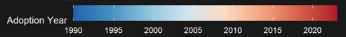

# **Exemplary Code Chunk**
### *Creating a Gradient Color Scheme to Show UAV Diffusion Over Time*

# What this chunk does
It takes the raw COW Armed UAV adoption and produces a choropleth showing when each country first adopted armed UAVs. 
The pipeline itself:
- filters for UAV records
- computes each state's first adoption year with `group_by` + `summarise(min(year))`
- joins the result onto world map polygons through a manual country-name lookup table.
- renders it with a sequential blue-to-red color scale from early to recent adopters (see below).

### *Some small details I want to note:*
- `scale_fill_gradientn()` uses an 8-stop ColorBrewer RdBu palette, which is generally colorblind-safe.
- `coord_fixed(1.3)` locks the aspect ratio; `ylim = c(-55, 83)` crops Antarctica without distorting the rest of the projection.
- `na.value = "grey20"` keeps non-adopters visually distinct from
  unmapped data.

# **Why I want to highlight this**
Reconciling COW state names with the region names in the map data — "United States of America" vs. "USA," "Russia" vs. "Russian Federation," and so on, was difficult. I didn't want to rely on string matching (which silently mismatches), so the `country_mapping` tibble handles every case explicitly, and any unmapped country surfaces as a visible NA on the map instead of a silent error.

 # **Here is the code:** 
### First, I extracted UAV adoption years
```{r}
uav_adoption <- cow_long |>
  filter(techtype == "Armed UAVs", !is.na(use), use %in% c(1, 9)) |>
  group_by(statename) |>
  summarise(adoption_year = min(year), .groups = "drop")
```
### Then I maped COW state names to map region names
```{r}
country_mapping <- tribble(
  ~statename, ~region,
  "United States of America", "USA",
  "United Kingdom", "UK",
  "Russia", "Russia",
  "China", "China",
  # ... (full mapping table in actual code)
)
```
### Next I joined the adoption data to the world map
```{r}
uav_map_data <- uav_adoption_all |>
  left_join(country_mapping, by = "statename") |>
  filter(!is.na(region))

world_uav <- world_map |>
  left_join(uav_map_data, by = "region")
```
### Finally, I rendered the gradient map 
```{r}
ggplot(world_uav, aes(x = long, y = lat, group = group)) +
  geom_polygon(aes(fill = adoption_year), color = "grey30", linewidth = 0.1) +
  scale_fill_gradientn(
    colors = c("#2166ac", "#4393c3", "#92c5de", "#d1e5f0", "#fddbc7", "#f4a582", "#d6604d", "#b2182b"),
    na.value = "grey20",
    name = "Adoption Year",
    breaks = seq(1990, 2023, by = 5),
    labels = seq(1990, 2023, by = 5),
    limits = c(1990, 2023)
  ) +
  coord_fixed(1.3, ylim = c(-55, 83), expand = FALSE) +
  labs(
    title = "UAV Diffusion Eminates from the Middle East (Iran) and Asia (China)",
    caption = "Source: COW Arms Technology Dataset v1.0 (2025). Blue = early adopters, Red = recent adopters."
  )… (full ggplot in code)
```
### And here is how the gradient scale turned out (full map in *Final Product*):

