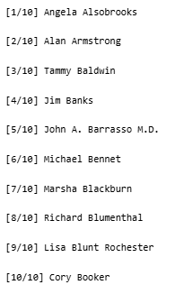

# Web Scraping to Track Senator Bill Sponsorship Trends
_____
My function automates the extraction of legislative data from senator profile pages using headless browser automation. 
It navigates to each senator's page, waits for the content to load, then parses the HTML to extract 
the number of bills sponsored and their top policy topic. 

Developing this was genuinely challenging. Standard web scraping methods didn't yield effective results, and I kept getting blocked.
Hence, I needed to simulate a real browser.
My function uses error handling to prevent the script from crashing if one page fails, ensures the browser closes properly, 
and prases missing data quite effectively. 
It's designed to work with a list of senator URLs, making it easy to collect data for the entire Senate in a single pipeline.
_____
## Why I think this is noteworthy
This function enables large-scale web scraping while avoiding detection and blocking by websites. 
Its uses a real Chrome browser running in the background to load pages exactly like a human would, which bypasses restrictions that block download requests.
It's also designed to protect against errors. In this case, if one senator's page fails to load (or has unexpected formatting) the script logs a warning and continues instead of crashing, ensuring that you don't lose all your data from one bad page.
This function also uses regex to find specific numbers and labels, like pulling "127" from "Bills Sponsored: 127 bills".
And lastly, it is designed to be reusable. You can modify this code to scrape most websites and could (theoretically) scale to thousands of pages.
_____
## Here is the underlying code:
### First, I launched a headless browser and masked it to avoid bot detection
```{r}
library(chromote)
library(rvest)
library(tidyverse)

loop_to_extract_bills <- function(senator_url) {
  tryCatch({
    browser <- ChromoteSession$new()
    on.exit(browser$close(), add = TRUE)  
    browser$Network$setUserAgentOverride(
      userAgent = "Mozilla/5.0 (Windows NT 10.0; Win64; x64) AppleWebKit/537.36"
    )
```

### Second, I navigated to the page and waited for JavaScript to render
```{r}
    browser$Page$navigate(senator_url)
    Sys.sleep(3)
```
    
### Third, I extracted the fully rendered HTML
```{r}
    senator_page_html <- browser$Runtime$evaluate(
      "document.documentElement.outerHTML"
    )$result$value
    senator_page <- read_html(senator_page_html)
```
    
### Fourth, I parsed the number of bills sponsored
```{r}
    n_bills <- NA_integer_
    strong_tag_texts <- senator_page |> 
      html_elements("strong") |> 
      html_text2()
    
    bills_sponsored_idx <- which(str_detect(strong_tag_texts, "Bills Sponsored"))
    
    if (length(bills_sponsored_idx) > 0) {
      page_list_items <- senator_page |> html_elements("li")
      
      for (list_item in page_list_items) {
        list_item_strong_text <- list_item |> 
          html_element("strong") |> 
          html_text2()
        
        if (!is.na(list_item_strong_text) && 
            str_detect(list_item_strong_text, "Bills Sponsored")) {
          list_item_full_text <- list_item |> html_text2()
          # Extract number using regex lookbehind
          n_bills <- as.integer(
            str_extract(list_item_full_text, "(?<=Bills Sponsored:)\\s*(\\d+)")
          )
          break
        }
      }
    }
```
    
### Fifth, I parsed the top policy topic
```{r}
    top_topic <- NA_character_
    topic_tag_links <- senator_page |> html_elements("span.tag-link a")
    
    if (length(topic_tag_links) > 0) {
      first_topic_text <- topic_tag_links[1] |> html_text2()
      top_topic <- str_trim(first_topic_text)
    }
    
    tibble(n_bills = n_bills, top_topic = top_topic)
    
  }, error = function(e) {
    # Graceful failure - return NA values instead of crashing
    warning(sprintf("Error parsing %s: %s", senator_url, conditionMessage(e)))
    tibble(n_bills = NA_integer_, top_topic = NA_character_)
  })
}
```

### Sixth, I applied my function to all senators with progress tracking
```{r}
senator_profile_data <- map_df(seq_along(senators$url), ~{
  senator_url <- senators$url[.x]
  senator_name <- senators$name[.x]
  message(sprintf("[%d/10] %s", .x, senator_name))
  loop_to_extract_bills(senator_url)
})
```
### Lastly, I combined this with the original senator metadata
```{r}
senators_full <- bind_cols(senators, senator_profile_data) |>
  select(name, party, state, n_bills, top_topic, url)
```
_____
### And here was the output


